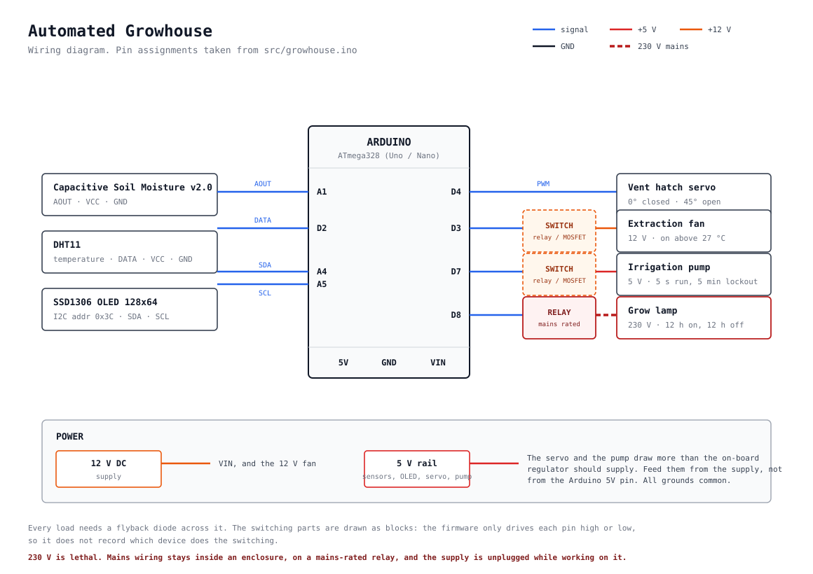

# Automated Growhouse

A greenhouse that waters, ventilates and lights itself. Three separate control loops on one Arduino, working across 5 V logic, a 12 V fan and 230 V mains through a relay.

---

## Control loops

### Irrigation

A capacitive soil moisture sensor reads the soil. Below threshold, a 5 V pump runs for **5 seconds**, then a **5-minute lockout** before another measurement can trigger another cycle.

The lockout is the point. Soil that has just been watered still reads dry, because it hasn't absorbed yet. Without that waiting time the pump re-triggers on every measurement and the plant drowns. Implemented as a state machine rather than a delay so the other loops keep running.

### Temperature

A DHT11 reads air temperature.

| Condition | Action |
|---|---|
| Above **27 °C** | 12 V fan starts, 3D-printed servo vent hatch opens |
| Below **25 °C** | Both close |

The 2 °C gap is deliberate hysteresis. With a single setpoint the fan switches on and off constantly every time the reading moves slightly across the line.

### Lighting

A 230 V grow lamp switched by relay on a 12-hour cycle.

### Display

Live temperature and moisture on an OLED.

---

## Hardware

| Function | Part |
|---|---|
| Soil moisture | Capacitive soil moisture sensor v2.0 |
| Air temperature | DHT11 |
| Irrigation | 5 V pump |
| Ventilation | 12 V fan + servo-driven 3D-printed hatch |
| Lighting | 230 V lamp on relay |
| Display | OLED |
| Controller | Arduino |

---

## Wiring

| Pin | Direction | Connected to |
|---|---|---|
| `A1` | analog in | Capacitive soil moisture sensor v2.0, AOUT |
| `D2` | digital in | DHT11 data |
| `D3` | digital out | Extraction fan, 12 V, through a switch |
| `D4` | PWM out | Vent hatch servo, signal |
| `D7` | digital out | Irrigation pump, 5 V, through a switch |
| `D8` | digital out | Grow lamp, 230 V, through a mains-rated relay |
| `A4` | I2C SDA | SSD1306 OLED |
| `A5` | I2C SCL | SSD1306 OLED |

The OLED sits on the hardware I2C pins, which are `A4` and `A5` on an Uno or
Nano, at address `0x3C`.

The soil sensor is calibrated in the firmware with `dry = 330` and
`wet = 196`, both read from this sensor in this soil. A different sensor or a
different pot needs those two numbers measured again.

Nothing on `D3`, `D7` or `D8` is driven straight from the pin. Each one goes
through a switch, and each load needs a flyback diode across it. The grow lamp
runs on mains, so it needs a mains-rated relay, an enclosure, and the supply
unplugged while you work on it.

---

## Building

Open `src/growhouse.ino` in the Arduino IDE and flash it to the board.
Serial output is plain text at **9600 baud**.

Libraries needed, all from the Library Manager:

- Adafruit GFX Library
- Adafruit SSD1306
- DHT sensor library
- Servo (ships with the IDE)

---

## TODO

- [ ] Add the STL for the vent hatch to `hardware/`
- [ ] Build photos in `docs/`
- [ ] Consider replacing the DHT11. It is slow and not very accurate; an SHT31 would give better accuracy and humidity data worth using
