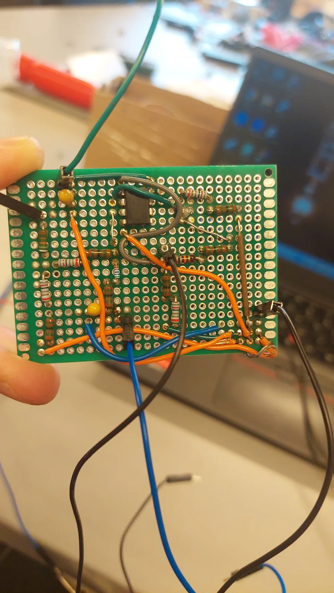
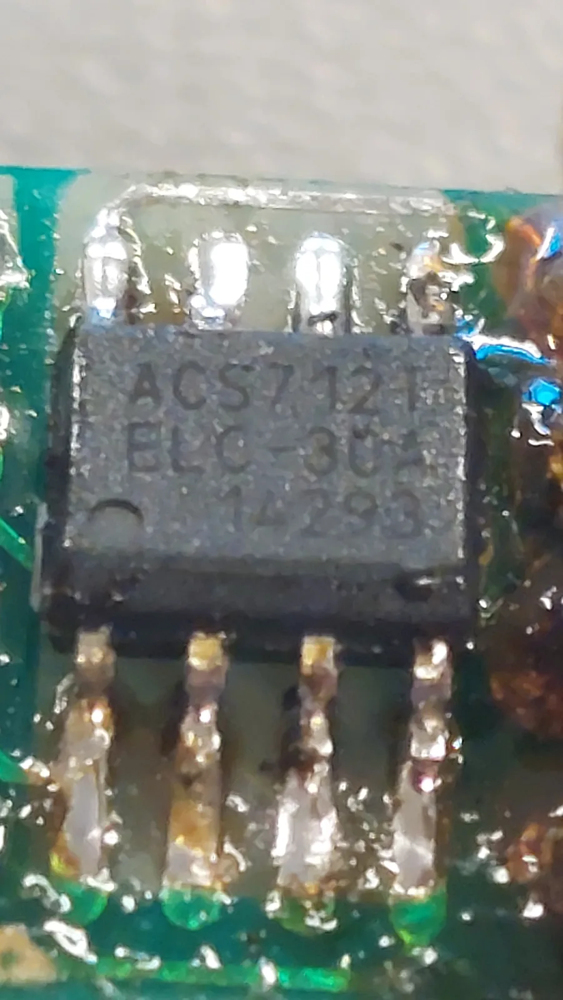
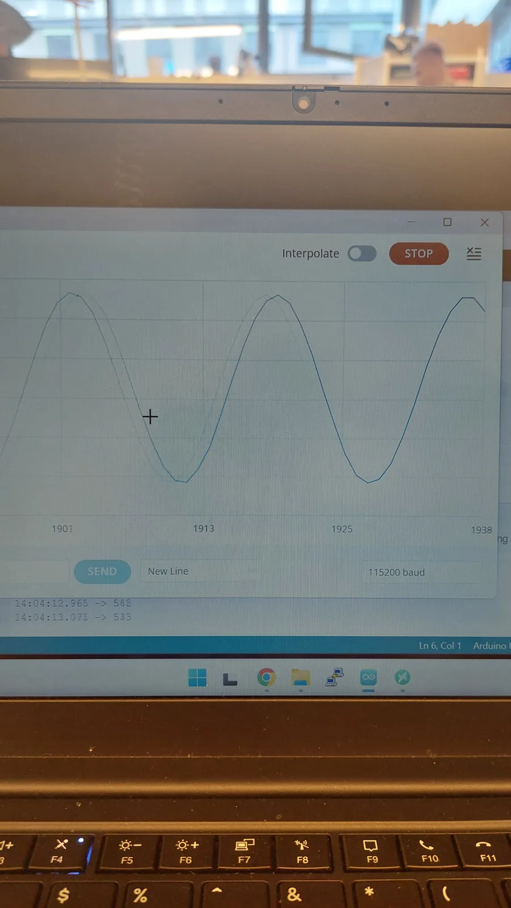

# AC/DC Power Meter

An instrument that measures voltage and current on either AC or DC loads and works out the full power picture in firmware — including whether the load is **inductive or capacitive**.

Built on an ATmega328-class AVR, sampling at register level rather than through the Arduino ADC API.



---

## What it does

Two multimeters can tell you volts and amps. They cannot tell you real power on a reactive load, because as soon as current and voltage fall out of phase, the product of their RMS values stops being the power actually delivered.

This meter measures both channels continuously and computes:

| Quantity | Symbol | How |
|---|---|---|
| RMS voltage | U<sub>rms</sub> | subtract the mean, then root-mean-square over the sample buffer |
| RMS current | I<sub>rms</sub> | same |
| Real power | P | mean of the instantaneous product u(t)·i(t) |
| Apparent power | S | U<sub>rms</sub> × I<sub>rms</sub> |
| Reactive power | Q | √(S² − P²) |
| Power factor | cos φ | P / S |
| Load type | — | sign of the zero-crossing index difference |

---

## How the sampling works

The interesting part is the sampling, not the maths.

`analogRead()` blocks for ~100 µs and can only read one channel at a time, which makes it useless for sampling two waveforms that have to line up. Instead the ADC is configured directly and runs interrupt-driven:

1. **Timer1** is set to CTC mode and fires a compare interrupt at a fixed rate. That interrupt selects the voltage channel and starts a conversion.
2. **The ADC ISR** stores the result. If it just read voltage, it switches the multiplexer to the current channel and immediately starts a second conversion. If it just read current, it advances the buffer index.
3. When both 200-sample buffers are full, a flag hands them to the main loop.

The result is that voltage and current are sampled back-to-back on every tick, so the phase relationship between them is kept — which is what the inductive/capacitive detection is based on.

## Phase detection

`findZCIndex()` walks each buffer looking for the first sample pair that sits either side of the signal's own mean — a zero crossing of the AC component. Comparing where voltage crosses against where current crosses gives the phase relationship:

- current crossing **after** voltage → current lags → **inductive**
- current crossing **before** voltage → current leads → **capacitive**
- same index → resistive

---

## Hardware

| Function | Part | Notes |
|---|---|---|
| Current sensing | **ACS712** | Hall-effect. Chosen because it works for AC *and* DC, unlike a shunt-plus-differential-amp arrangement |
| Voltage sensing (DC) | 56 kΩ / 330 kΩ divider | Simple resistive scaling |
| Voltage sensing (AC) | Op-amp front end | Biases the waveform to mid-rail and scales it into the ADC input range |
| Controller | ATmega328-class AVR | Arduino-compatible board |
| Construction | Hand-soldered perfboard | |

<p align="center">
  
  
</p>

---

## Building

Open `src/power_meter.ino` in the Arduino IDE and flash to an ATmega328-based board. Output is plain text over serial at **115200 baud**.

Channel assignment:

- `ADC0` — voltage
- `ADC1` — current

---

## Known limitations

Documented rather than hidden — these are the things I would fix next.

### The buffers are not double-buffered

`bufferReady` is set the moment `sampleIndex` wraps, but the ADC interrupt immediately starts writing to `bufferU[0]` again while `processBuffer()` is still reading it. Every result is therefore computed over a buffer that is partly being overwritten as it is read.

At roughly 1 ms per sample pair a full buffer takes about 200 ms to fill, and processing plus the serial output takes about 10–20 ms — so about 5–10% of each buffer is next-cycle data. For a steady periodic signal the effect is small, but it is still a real race condition. Two alternating buffers with the ISR writing one while the main loop reads the other would remove it entirely.

### Scaling cuts off the decimals too early

```c
int32_t diffU = ((int32_t)bufferU[i] - (int32_t)averageU) * SCALE_U;
```

The multiply gives a float, but the assignment cuts it back to an integer — a difference of 4 ADC counts × 0.21 becomes 0, not 0.84. Because it cuts toward zero rather than to the nearest value, the error always goes the same way, so RMS and power come out too low rather than just noisy. Accumulating in `float` fixes it.

`(int32_t)averageU` cuts off the mean the same way, adding up to a full count of DC offset to every sample.

### Zero-crossing direction is not checked

`findZCIndex()` returns the first crossing it finds, regardless of whether the signal is rising or falling through its mean. If voltage happens to cross rising and current crosses falling, the index difference between them is not a phase difference at all. Matching crossing direction — and averaging across several crossings — would make the inductive/capacitive result reliable rather than only usually correct.

### Calibration is hard-coded

`SCALE_U` and `SCALE_I` are constants I worked out by measurement for this board's specific divider and sensor. Moving them to EEPROM behind a calibration routine would make this an instrument rather than something that only works on one board.

---

## Repository notes

The firmware in `src/` is the original working code with comments and two named constants added; the logic is unchanged.
