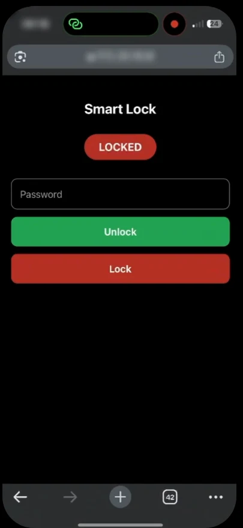

# SmartTurn — Retrofit Smart Lock

A device that lets you lock and unlock an ordinary interior door from your phone, without changing the lock. About €15–30 in parts.

Team project (3 people) at Riga Technical University. **My contribution: hardware, firmware and mechanical design.**

---

## The problem

Most interior doors have no keyhole on the inside, just a thumb-turn. Every commercial smart lock requires replacing the cylinder, which renters are not allowed to do and students cannot afford.

| Product | Price | Requires |
|---|---|---|
| Yale Linus | €200–280 | Full cylinder replacement |
| Nuki | €150–250 | Cylinder work |
| SwitchBot Lock | €100–130 | Retrofit, but expensive |
| **SmartTurn** | **€50–90 (est. selling price)** | Adhesive or screws |

## How it works

A 3D-printed gripper clamps over the existing thumb-turn. A 13 kg-rated MG996R metal-gear servo turns it. An ESP32 provides Wi-Fi and Bluetooth control alongside a physical button on the unit.

The design constraint: it operates from the inside only, and the outside key keeps working exactly as before. The lock is never replaced or bypassed, only turned.

## Phone control

The ESP32 connects to the Wi-Fi network and serves its own control page, so any phone browser works and there is no app to install. The page shows the lock state, a password field and Unlock / Lock buttons. A command turns the servo to the matching position and the page shows the new state. The physical button on the unit still works when no phone is to hand.

  

The phone has to be on the same network as the lock, and the page runs over plain HTTP. Both are the first items under Next steps.

---

## Hardware

| Function | Part | Cost |
|---|---|---|
| Controller | ESP32 dev board | €5–10 |
| Actuator | MG996R servo, 13 kg, 4.8–6.0 V | €3–7 |
| Gripper | 3D printed, PLA/PETG | €1–3 |
| Power | 5 V/3 A USB-C or 4×AA | €3–6 |
| Housing | 3D printed + adhesive or screws | €1–3 |
| Input | Physical button | €0.50–1 |
| Wiring | Jumpers, solder | €1–2 |

**Total BOM: €15–30**

---

## Test results

Prototype tested in normal daily use.

| Aspect | Result |
|---|---|
| Door opening | Reliable; torque is enough for standard locks |
| Servo | Stable, same rotation angle every time, no skipped steps |
| ESP32 control | No hangs; precise PWM generation and command handling |
| Mounting | Good enough, but the housing bends slightly under high load |
| Gripper | Needs fitting to each lock type, otherwise it goes off-axis and slips |

---

## Next steps

- Move the control page to an encrypted connection. It runs over plain HTTP now, so the password crosses the network unencrypted.
- Access from outside the home network, through a small cloud relay or Matter. Today the phone has to be on the same Wi-Fi as the lock.
- A stiffer housing
- A gripper that adjusts to more than one knob shape without a reprint

## TODO

- [ ] Add ESP32 firmware to `src/`
- [ ] Add gripper and housing STLs to `hardware/`
- [ ] Wiring diagram
- [ ] Photos of the prototype mounted on a door
