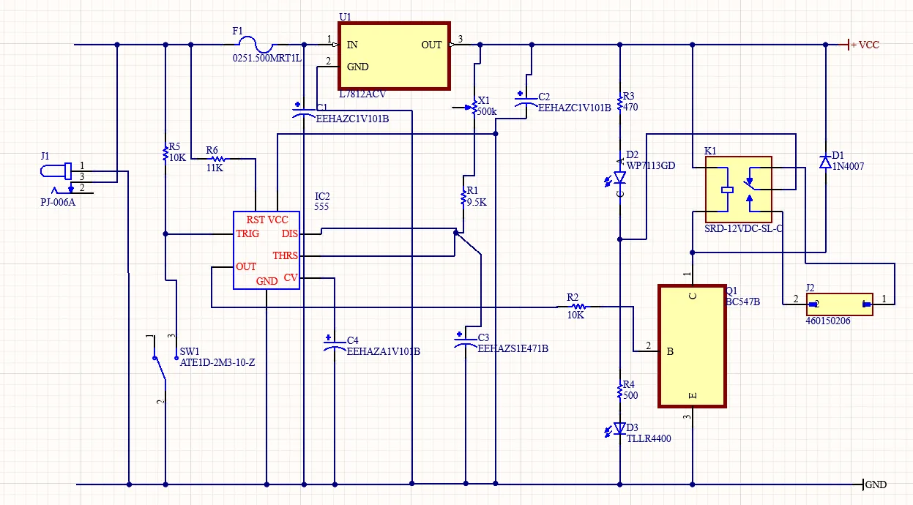
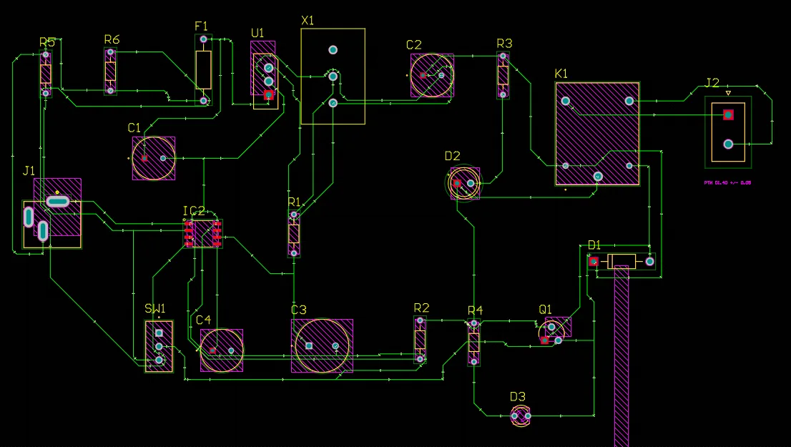

# NE555 Timer Relay — PCB Design

A single-layer through-hole board for an adjustable-delay timer relay. Press the trigger, the relay pulls in, and it drops out after a delay set by a front-panel potentiometer — anywhere from a few seconds to several minutes.

  
  

---

## Circuit

| Stage | Part | Role |
|---|---|---|
| Supply | L7812 | 12 V regulation |
| Timing | NE555 | Monostable; delay set by RC |
| Adjustment | 500 kΩ potentiometer | Sets the delay |
| Switching | BC547B | Drives the relay coil |
| Output | 12 V SPDT relay | With 1N4007 flyback diode |
| Indication | Green + red LEDs | State |

22 components total.

---

## The design work

The schematic is the easy part. What this project was actually about:

**Drill diameters** were worked out per component rather than guessed — from each part's lead diameter, the plating thickness, and some extra room for manufacturing tolerance.

**Trace widths** were calculated from current density rather than left at a default. The board runs 1.00 mm traces, well above the calculated minimum.

**Signal frequencies** were checked to confirm that trace length did not matter here. Everything on the board is DC or well under a hertz, so parasitic effects in the traces do not matter and routing could be done for a tidy layout instead of for length. Worth checking rather than assuming.

---

## TODO

- [ ] Add Altium project files to `hardware/`
- [ ] Export and add Gerbers
- [ ] Photo of the assembled board, if one was built
- [ ] Fix the trace-width table in the original report — the text calculates 0.5 / (30 × 0.035) = 0.48 mm, but the table lists 0.017 mm, which drops the copper thickness term. The board is unaffected; the document isn't.
